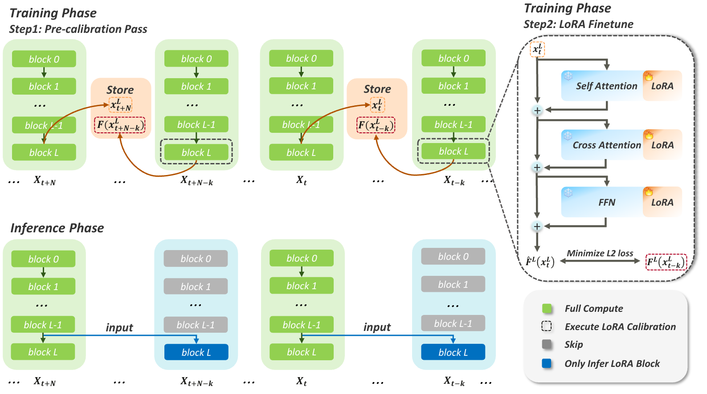

# LearniBridge: Learnable Calibration of Feature Caching for Diffusion Model Acceleration

### Abstract

Diffusion Transformers (DiTs) have driven substantial progress in image and video generation, but they suffer from prohibitive computational costs. While feature caching accelerates inference by reusing intermediate representations, existing methods typically rely on simply duplicating historical features. This approach, while easy to implement, suffers from severe error accumulation at high acceleration ratios.

To address this limitation, we investigate the underlying mechanics of feature correction. We demonstrate that the optimal calibration update is characterized by a shared low-rank subspace across diverse prompts. Guided by this structural insight, we propose **LearniBridge**, a learnable calibration mechanism for feature caching that bridges multiple timesteps through lightweight LoRA updates. Remarkably, this mechanism enables effective calibration using as few as 3 to 5 training samples.

Extensive experiments on image and video generation tasks demonstrate that **LearniBridge** achieves up to $5.87\times$, $5.75\times$, and $4.10\times$ acceleration on FLUX, HunyuanVideo, and Wan 2.1, respectively. Notably, on Wan 2.1, it improves the VBench score by 1.28% over the previous state-of-the-art (SOTA) at a $4.10\times$ acceleration rate.

### Overview

Our method consists of two primary stages: a **training phase** and an **inference phase**.

* **Training Phase:**
    * **Pre-calibration:** We first perform a full computation pass across all timesteps. During this step, we record the final-block input $x_t^L$ and its corresponding ground-truth output $F^L(x_{t-k}^L)$ for the calibrated timesteps.
    * **LoRA Finetuning:** Next, lightweight LoRA adapters are trained within the final block to efficiently map the cached input $x_t^L$ directly to the corresponding full-computation output $F^L(x_{t-k}^L)$.
* **Inference Phase:**
    * Full computation at the target timesteps is completely skipped. Instead, the model only executes the LoRA-augmented final Transformer block, drastically accelerating the generation process.

> 🚧 **Note:** This repository is currently under construction. Code and related resources will be available soon.
