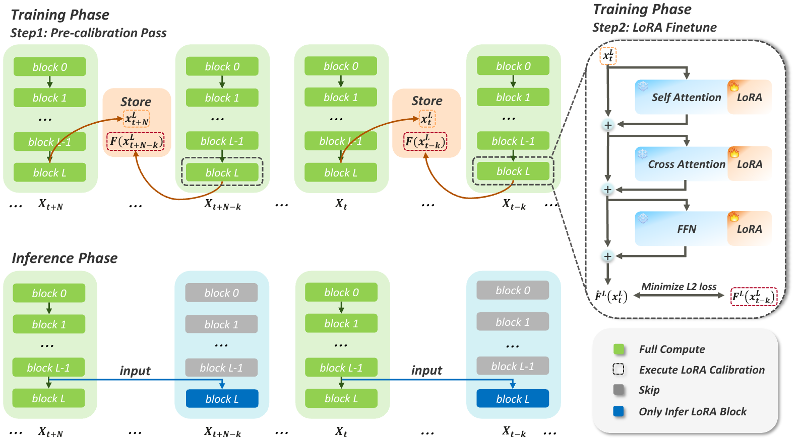
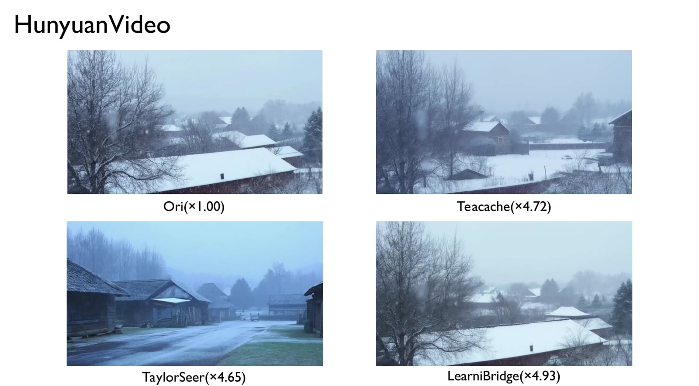

# ⚡ LearniBridge: Learnable Calibration of Feature Caching for Diffusion Model Acceleration

Diffusion Transformers produce high-quality images and videos, but repeated computation across denoising steps makes inference expensive. Feature caching reduces this cost, while directly reusing historical features can accumulate errors at high acceleration ratios.

**LearniBridge** learns lightweight LoRA-based corrections in the final Transformer block to calibrate cached features. This repository provides the complete **cache → train → infer** workflow for **FLUX.1-dev, HunyuanVideo, and Wan2.1-T2V-1.3B**.

## Overview



## Results

### Image


### Video

[](assets/results/video.mp4)

[Watch the video](assets/results/video.mp4)

## Usage

1. **Cache:** extract features using the original model.
2. **Train:** fit LoRA adapters on the cached features.
3. **Infer:** load the adapters to accelerate generation.

Choose a backend for its environment setup and complete commands:

| Backend | Task | Guide |
| --- | --- | --- |
| FLUX.1-dev | Text-to-image | [FLUX](flux/README.md) |
| HunyuanVideo | Text-to-video | [HunyuanVideo](hunyuan/README.md) |
| Wan2.1-T2V-1.3B | Text-to-video | [Wan2.1](wan/README.md) |

<details>
<summary>Installation and commands for all three models</summary>

### Installation

Use a separate environment for each backend. Python 3.10 is recommended for the video backends. Install a CUDA-compatible PyTorch build first, then install the selected backend's dependencies:

```bash
git clone https://github.com/Iiiiiiirene/LearniBridge.git
cd LearniBridge
python -m pip install -r requirements/flux.txt
python -m pip install -e . --no-deps
```

For HunyuanVideo and Wan2.1, use `requirements/hunyuan.txt` or `requirements/wan.txt` in the corresponding separate environment and follow the linked backend guide to make the upstream implementation available. Base model weights and large feature caches are not included in this repository.

Choose one backend below and run its cache, training, and inference commands from the repository root in the same environment. Replace the example model/source paths with your local directories. Use an available GPU and new output directories to avoid overwriting previous experiments.

### 1. Cache Features

#### FLUX.1-dev

Use the first 10 prompts from the provided calibration list:

```bash
export FLUX_MODEL=/path/to/FLUX.1-dev
export N=5

python run.py flux cache \
  --model-path "$FLUX_MODEL" \
  --prompt-file flux/prompts/train.txt --max-prompts 10 \
  --num-steps 50 --precision fp16 \
  --output-dir cache/flux
```

#### HunyuanVideo

Use all 6 original calibration prompts. Set `MODEL_BASE` before launching Python:

```bash
export HUNYUAN_SOURCE=/path/to/HunyuanVideo
export PYTHONPATH="$HUNYUAN_SOURCE${PYTHONPATH:+:$PYTHONPATH}"
export MODEL_BASE=/path/to/HunyuanVideo-weights
export DIT_WEIGHT="$MODEL_BASE/hunyuan-video-t2v-720p/transformers/mp_rank_00_model_states.pt"
export N=5

python run.py hunyuan cache \
  --model-base "$MODEL_BASE" --dit-weight "$DIT_WEIGHT" \
  --prompt-file hunyuan/prompts/prompt.txt --max-prompts 6 \
  --feature-dir cache/hunyuan --cache-blocks 38 39 \
  --video-size 544 960 --video-length 49 --infer-steps 50 \
  --seed 42 --embedded-cfg-scale 6.0 --flow-shift 7.0 \
  --flow-reverse --use-cpu-offload --save-path runs/hunyuan/cache-preview
```

#### Wan2.1-T2V-1.3B

Use all 11 original calibration prompts:

```bash
export WAN_SOURCE=/path/to/Wan2.1
export PYTHONPATH="$WAN_SOURCE${PYTHONPATH:+:$PYTHONPATH}"
export CKPT_DIR=/path/to/Wan2.1-T2V-1.3B
export N=5

python run.py wan cache \
  --task t2v-1.3B --ckpt_dir "$CKPT_DIR" \
  --prompt-file wan/prompts/prompts.txt --max-prompts 11 \
  --feature-dir cache/wan --cache-blocks 28 29 \
  --size '832*480' --frame_num 81 --sample_steps 50 \
  --base_seed 42 --sample_shift 5 --sample_guide_scale 5 \
  --offload_model True --t5_cpu
```

Each backend organizes the cache as one numbered directory per prompt. The video `--cache-blocks` options select which features to save; they do not skip model computation.

### 2. Train Adapters

#### FLUX.1-dev

```bash
python scripts/train_schedule.py --model flux \
  --N "$N" --num-steps 50 \
  --ckpt-dir "$FLUX_MODEL" \
  --feature-roots cache/flux/{0..9} \
  --output-dir "runs/flux/N${N}/adapters" --gpus 0
```

#### HunyuanVideo

```bash
python scripts/train_schedule.py --model hunyuan \
  --N "$N" --num-steps 50 \
  --ckpt-dir "$MODEL_BASE" \
  --feature-roots cache/hunyuan/{0..5} \
  --output-dir "runs/hunyuan/N${N}/adapters" --gpus 0
```

#### Wan2.1-T2V-1.3B

```bash
python scripts/train_schedule.py --model wan \
  --N "$N" --num-steps 50 \
  --ckpt-dir "$CKPT_DIR" \
  --feature-roots cache/wan/{0..10} \
  --output-dir "runs/wan/N${N}/adapters" --gpus 0
```

With `--N`, the scheduler derives targets and offsets automatically while preserving each backend's original learning rate and epoch defaults. Add `--dry-run` to inspect the full schedule and commands without starting training. Do not combine `--N` with manual `--steps`/`--offsets`.

For a one-epoch connectivity check, add `--epochs 1` and use a fresh adapter directory; pass that same directory to inference. This does not validate convergence or final generation quality. Omitting `--epochs` uses the original defaults: 800 for FLUX and 5000 for HunyuanVideo/Wan.

### 3. Run Inference

These single-prompt examples load the adapters produced by the matching training commands above. Each uses the same `--N` schedule as training; no hand-written replacement list is needed.

#### FLUX.1-dev

```bash
python run.py flux infer \
  --N "$N" \
  --model-path "$FLUX_MODEL" \
  --adapter-dir "runs/flux/N${N}/adapters" \
  --prompt "Three-quarters front view of a blue 1977 Porsche 911 coming around a curve in a mountain road" \
  --num-steps 50 --seed 42 \
  --output-dir "runs/flux/N${N}/images"
```

#### HunyuanVideo

```bash
python run.py hunyuan infer \
  --N "$N" \
  --model-base "$MODEL_BASE" --dit-weight "$DIT_WEIGHT" \
  --lora-dir "runs/hunyuan/N${N}/adapters" \
  --prompt "$(head -n 1 hunyuan/prompts/sample_50.txt)" \
  --block-idx 39 --target-modules auto --lora-rank 32 --lora-alpha 64 \
  --video-size 544 960 --video-length 49 --infer-steps 50 \
  --seed 42 --embedded-cfg-scale 6.0 --flow-shift 7.0 \
  --flow-reverse --use-cpu-offload \
  --save-path "runs/hunyuan/N${N}/videos"
```

#### Wan2.1-T2V-1.3B

```bash
mkdir -p "runs/wan/N${N}/videos"
python run.py wan infer \
  --N "$N" \
  --task t2v-1.3B --ckpt_dir "$CKPT_DIR" \
  --lora_dir "runs/wan/N${N}/adapters" \
  --prompt "$(head -n 1 wan/prompts/wan_sample_50.txt)" \
  --lora_rank 32 --lora_alpha 64 \
  --size '832*480' --frame_num 81 --sample_steps 50 \
  --base_seed 42 --sample_shift 5 --sample_guide_scale 5 \
  --offload_model True --t5_cpu \
  --save_file "runs/wan/N${N}/videos/example.mp4"
```

The video commands use the first prompt from each original test list; replace the `--prompt` value with your own text for other examples. Outputs are separated by backend and `N` under `runs/`. Use a different output path for repeat runs.

In `--N` mode, missing or mismatched adapters are rejected instead of silently falling back to another method. Without `--N`, legacy entry points retain the original manual schedules and three branches: full computation, LoRA calibration, and cached-residual reuse where no adapter exists. Existing legacy adapters are not automatically certified for a new periodic schedule.

</details>

<details>
<summary>Repository layout and development</summary>

## 📁 Repository Layout

```text
LearniBridge/
├── assets/                 # Method overview
├── flux/                   # FLUX feature caching, training, and inference
├── hunyuan/                # HunyuanVideo feature caching, training, and inference
├── wan/                    # Wan2.1 feature caching, training, and inference
├── learnibridge/           # Shared LoRA, checkpoint, and compatibility utilities
├── requirements/           # Separate backend dependency sets
├── scripts/                # Training scheduler and lightweight source checks
└── run.py                  # Model entry-point launcher
```

Commands run from the repository root; relative data paths keep their normal working-directory meaning. `extract` remains available as an alias for `cache`.

## Development

```bash
python scripts/check_source.py
python scripts/validate_schedule.py
python scripts/validate_core.py
python -m compileall -q learnibridge flux hunyuan wan scripts run.py
```

The CI workflow runs lightweight source checks and builds the core package. It does not download model weights or start GPU training.

</details>

## License

Original LearniBridge code is licensed under [Apache-2.0](LICENSE). Third-party code and model weights retain their own terms; see [NOTICE](NOTICE) and [third-party notices](THIRD_PARTY_NOTICES.md).
